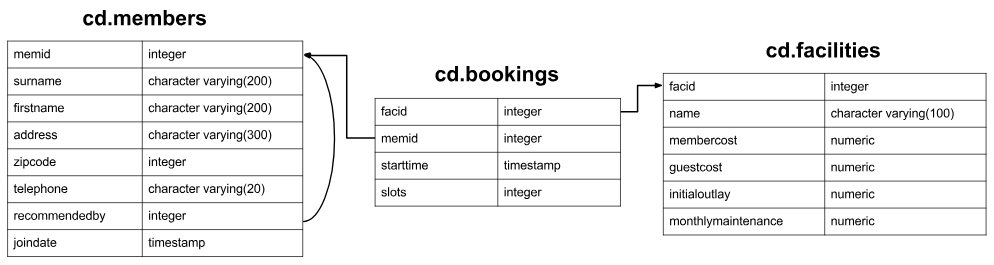

# SQL Exercise: Calculate a rolling average of total revenue

## Schema Reminder:



## Question:

For each day in August 2012, calculate a rolling average of total revenue over the previous 15 days. Output should contain date and revenue columns, sorted by the date. Remember to account for the possibility of a day having zero revenue.

## Expected Output:

| Date       | Revenue |
| ---------- | ------- |
| 2012-08-01 | 1126.83 |
| 2012-08-02 | 1153.00 |
| 2012-08-03 | 1162.90 |
| 2012-08-04 | 1177.37 |
| 2012-08-05 | 1160.93 |
| 2012-08-06 | 1185.40 |
| 2012-08-07 | 1182.87 |
| 2012-08-08 | 1172.60 |
| 2012-08-09 | 1152.47 |
| 2012-08-10 | 1175.03 |
| 2012-08-11 | 1176.63 |
| 2012-08-12 | 1195.67 |
| 2012-08-13 | 1218.00 |
| 2012-08-14 | 1247.47 |
| 2012-08-15 | 1274.10 |
| 2012-08-16 | 1281.23 |
| 2012-08-17 | 1324.47 |
| 2012-08-18 | 1373.73 |
| 2012-08-19 | 1406.07 |
| 2012-08-20 | 1427.07 |
| 2012-08-21 | 1450.33 |
| 2012-08-22 | 1539.70 |
| 2012-08-23 | 1567.30 |
| 2012-08-24 | 1592.33 |
| 2012-08-25 | 1615.03 |
| 2012-08-26 | 1631.20 |
| 2012-08-27 | 1659.43 |
| 2012-08-28 | 1687.00 |
| 2012-08-29 | 1684.63 |
| 2012-08-30 | 1657.93 |
| 2012-08-31 | 1703.40 |

## Answer:

```sql
with daily_revenue_data AS (
  SELECT
    date_trunc('day', starttime) as date,
    SUM(
      CASE
        WHEN bks.memid = 0 THEN bks.slots * fcs.guestcost
        ELSE bks.slots * fcs.membercost
      END
    ) as daily_revenue
  FROM
    cd.bookings bks
    INNER JOIN cd.facilities fcs ON fcs.facid = bks.facid
  GROUP BY
    1
),
date_series as (
  SELECT
    (
      generate_series(
        '2012-08-01'::timestamp - interval '14 days',
        '2012-08-31'::timestamp,
        '1 day'::interval
      )
    )::date as date
),
avg_revenue as (
  SELECT
    date_series.date as date,
    avg(daily_revenue) over(
      order by
        date_series.date rows 14 preceding
    ) as average_revenue
  from
    date_series
    LEFT OUTER JOIN daily_revenue_data on date_series.date = daily_revenue_data.date
)
SELECT
  date,
  average_revenue
from
  avg_revenue
WHERE
  date >= '2012-08-01'
order by
  1;
```
